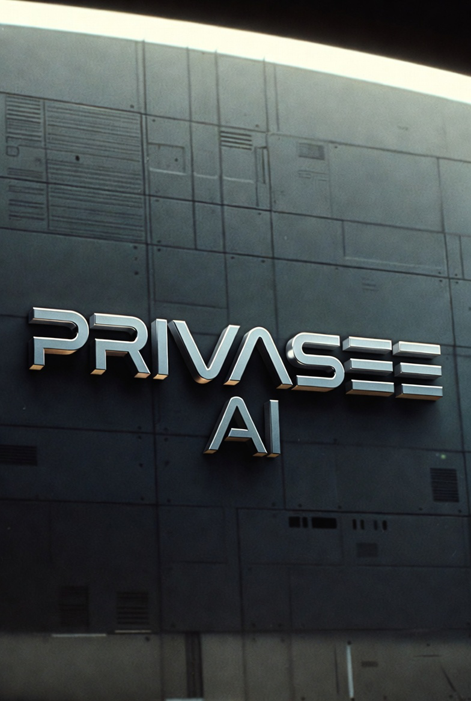

<p align="center">
  
</p>

<h1 align="center">PRIVASEE AI</h1>
<p align="center"><strong>The Sentinel — AI-Powered Edge Security Monitoring Platform</strong></p>

<p align="center">
  A cloud-native, privacy-first security monitoring system that runs real-time AI object detection on live video streams, syncs events to Azure Blob Storage, and supports multi-tenant deployments across distributed edge devices.
</p>

<p align="center">
  <a href="https://opensource.org/licenses/Apache-2.0"></a>
  
  
  
  
  
</p>

---

## Architecture

PRIVASEE AI is a single-page application with an Express backend, designed for edge deployment on any device with a camera.

```
┌────────────────────────────────────────────────────────────────┐
│                   Browser / Mobile / Tablet                    │
│          React + Vite · TailwindCSS · Sentinel Dark Theme      │
└──────────────────────────┬─────────────────────────────────────┘
                           │
                 ┌─────────┴──────────┐
                 │  Express Backend   │  ← Node.js · server.js
                 │    :8080           │     AES-256-GCM settings
                 └─────────┬──────────┘     Prisma → PostgreSQL
                           │
          ┌────────────────┼─────────────────┐
          │                │                 │
  ┌───────┴──────┐  ┌──────┴──────┐  ┌──────┴───────┐
  │  Azure Blob  │  │  Azure AD   │  │  Azure       │
  │  Storage     │  │  (MSAL v5)  │  │  PostgreSQL  │
  │  (Events +   │  │  Auth0      │  │  (UserSettings│
  │   Media)     │  │  OAuth 2.0  │  │   multi-tenant│
  └──────────────┘  └─────────────┘  └──────────────┘
          │
  ┌───────┴──────────────────────────────────────────┐
  │              TensorFlow.js / COCO-SSD            │
  │   Real-time object detection in-browser (WebGL)  │
  │   Drone SDK: Autel EVO Lite via WebSocket        │
  └──────────────────────────────────────────────────┘
```

---

## Quick Start

### Docker / Azure Container Apps

```bash
git clone https://github.com/aurelianware/privaseeAI.git
cd privaseeAI
docker build -t privaseeai .
docker run -p 8080:8080 privaseeai
```

App: http://localhost:8080

### Local Development

```bash
# Prerequisites: Node.js 20+, npm

git clone https://github.com/aurelianware/privaseeAI.git
cd privaseeAI

npm install

# Copy and fill in environment variables
cp .env.example .env.local

# Start Vite dev server (frontend)
npm run dev

# In a second terminal — start Express backend
npm start
```

Frontend: http://localhost:3000 · Backend: http://localhost:8080

---

## Features

### Real-Time AI Detection
- **COCO-SSD / TensorFlow.js** — in-browser WebGL object detection, zero server-side inference latency
- **Detection overlays** — colour-coded bounding boxes rendered on a canvas stream capture
- **Confidence scoring** — per-object confidence percentages, configurable threshold
- **Annotated captures** — JPEG snapshots and WebM/MP4 recordings with detection overlays baked in

### Security Event Pipeline
- **Severity classification** — critical / high / medium / low with Sentinel colour coding
- **IndexedDB local storage** — full offline capability with proper IDB initialisation and reopen on close
- **Azure Blob sync** — background upload queue with SAS token auth; media blobs preserved with original MIME types
- **Real-time event list** — live "time ago" ticker, media playback modal, error surface for `MediaError` codes

### Multi-Tenant SaaS
- **Per-user encrypted settings** — AES-256-GCM server-side settings API, keyed by Azure AD `oid`
- **Azure PostgreSQL** — `UserSettings` table, Prisma schema, raw SQL migration included
- **MSAL v5** — `@azure/msal-browser` + `@azure/msal-react`; Auth0 also supported

### Multi-Camera & Drone
- **IP / RTSP camera management** — add cameras by ID + RTSP URL; HLS transcoding via server
- **AGM Taipan V2 thermal** — auto-detect probe
- **Autel EVO Lite drone SDK** — takeoff/landing, waypoint missions, RTH, emergency land via WebSocket relay

---

## Technology Stack

| Layer | Technology |
|-------|-----------|
| Frontend framework | React 18 + TypeScript 5 |
| Build tool | Vite 7 |
| Styling | Tailwind CSS + inline Sentinel design tokens |
| AI inference | TensorFlow.js · COCO-SSD (WebGL) |
| Authentication | MSAL v5 (Azure AD) · Auth0 |
| Backend | Node.js · Express |
| Database ORM | Prisma 7 |
| Database | Azure Database for PostgreSQL (Flexible Server) |
| Media storage | Azure Blob Storage (SAS, CORS) |
| Containerisation | Docker (multi-stage, node:20-alpine runtime) |
| Deployment | Azure Container Apps (via GitHub Actions CI/CD) |
| Container registry | Azure Container Registry (ACR) |
| IaC | Azure Bicep (`deploy/azure-app-service.bicep`) |

---

## Project Structure

```
privaseeAI/
├── src/
│   ├── App.tsx                    # Root component — Sentinel UI shell
│   ├── components/
│   │   ├── CameraStream.tsx       # WebRTC camera + TensorFlow inference loop
│   │   ├── DetectionOverlay.tsx   # Canvas bounding box renderer
│   │   ├── EventsList.tsx         # Security event feed with media playback
│   │   ├── HlsVideoPlayer.tsx     # IP camera HLS stream player
│   │   ├── MissionDashboard.tsx   # Drone mission control UI
│   │   ├── SettingsPanel.tsx      # User settings + Azure config
│   │   └── Auth.tsx / Auth0Components.tsx / AuthProvider.tsx
│   ├── hooks/
│   │   └── useUserSettings.ts     # AES-256-GCM encrypted settings hook
│   ├── drone/                     # Autel EVO Lite SDK adapters
│   └── utils/
│       ├── storage.ts             # IndexedDB local event store
│       └── syncQueue.ts           # Azure Blob upload queue
├── prisma/
│   ├── schema.prisma              # UserSettings model
│   └── migrations/                # Raw SQL migrations
├── public/
│   ├── logo/                      # Animated logo (WebM + MP4 + poster)
│   ├── privaseeai-kubrick.png     # Brand hero image
│   └── privaseeai-brand.png       # Chrome 3D brand render
├── deploy/
│   └── azure-app-service.bicep    # Azure Bicep IaC
├── infra/
│   └── blob-lifecycle.json        # Blob storage lifecycle policy
├── docs/
│   ├── AZURE_DEPLOYMENT.md
│   ├── DEPLOYMENT_GUIDE.md
│   ├── SECURITY.md
│   ├── DRONE_INTEGRATION.md
│   ├── DRONE_SETUP.md
│   └── STRIPE_SETUP.md
├── .github/workflows/             # CI/CD: build-and-push → deploy-aca
├── server.js                      # Express backend (settings API, HLS proxy)
├── Dockerfile                     # Multi-stage production build
└── vite.config.ts
```

---

## CI/CD

Push to `main` triggers a two-stage GitHub Actions pipeline:

1. **`build-and-push.yml`** — builds the Docker image, tags with `$GITHUB_SHA`, pushes to ACR
2. **`deploy-aca.yml`** — updates the Azure Container App with the new image tag

Required GitHub secrets: `AZURE_CLIENT_ID`, `AZURE_TENANT_ID`, `AZURE_SUBSCRIPTION_ID`, `AZURE_RESOURCE_GROUP`, `ACR_NAME`, `ACA_ENVIRONMENT`.

See [docs/AZURE_DEPLOYMENT.md](docs/AZURE_DEPLOYMENT.md) for full setup.

---

## Roadmap

- [x] Real-time COCO-SSD detection with canvas overlay recording
- [x] Azure Blob Storage cloud sync with SAS auth
- [x] Multi-tenant AES-256-GCM encrypted user settings
- [x] Azure PostgreSQL backend with Prisma
- [x] MSAL v5 Microsoft Entra ID authentication
- [x] Sentinel brand redesign (dark glass-morphism, Kubrick aesthetic)
- [x] Animated logo video integration
- [x] IP / RTSP multi-camera management with HLS
- [x] Autel EVO Lite drone SDK integration
- [x] Docker + Azure Container Apps CI/CD pipeline
- [ ] YOLO v8 model swap for higher accuracy
- [ ] WebRTC peer-to-peer multi-device streaming
- [ ] Push notifications (Azure Notification Hubs)
- [ ] Mobile native app (Capacitor / iOS)
- [ ] Stripe billing for SaaS tiers
- [ ] Audit log export (SIEM integration)

---

## Related Projects

- **[Cloud Dental Office](https://github.com/aurelianware/clouddentaloffice)** — SaaS dental practice management with integrated privaseeAI vision service for narcotics cabinet monitoring, consent recording, and insurance card OCR
- Together, privaseeAI + Cloud Dental Office form a full provider-side AI vision + compliance stack

---

## License

[Apache License 2.0](LICENSE) — Copyright 2026 Aurelianware

